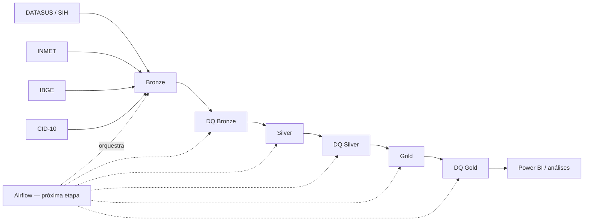

# Pipeline de Dados — TCC

Pipeline de Engenharia de Dados para integração de internações hospitalares,
meteorologia, municípios e classificação CID-10 no estado de São Paulo. O
recorte principal abrange as competências de 2023 a 2025.

## Status atual

| Componente | Status |
|---|---|
| Bronze | Implementada |
| Silver | Implementada |
| Gold | Implementada |
| Data Quality Bronze, Silver e Gold | Implementado e aprovado |
| Spark e Docker | Implementados |
| Airflow | Próxima etapa |
| Power BI | Planejado |

## Arquitetura



- **Bronze:** preserva os arquivos brutos recebidos.
- **Silver:** tipa, limpa, padroniza e agrega os dados.
- **Gold:** integra dimensões e fatos para consumo analítico.
- **Data Quality:** aplica controles específicos depois de cada camada.

O desenho detalhado está em
[`docs/assets/arquitetura_pipeline.png`](docs/assets/arquitetura_pipeline.png).

## Fontes

- DATASUS/SIH: internações hospitalares mensais em DBC.
- INMET: observações meteorológicas anuais em ZIP/CSV.
- IBGE: malha municipal de São Paulo de 2022.
- CID-10: capítulos, grupos, categorias e subcategorias.

## Principais resultados

| Dataset | Volume atual |
|---|---:|
| Silver SIH | 8.409.047 registros |
| Silver IBGE | 645 municípios |
| Silver CID-10 | 12.451 códigos |
| Silver INMET horário | 1.052.160 registros |
| Silver INMET diário | 43.840 registros |
| Gold município–estação | 645 registros |
| Gold fato de internação | 8.409.047 registros |
| Gold fato com meteorologia | 8.409.047 registros |

Os três níveis de DQ utilizam `ERROR`, `WARNING` e `INFO`. Apenas falhas
`ERROR` interrompem o processo. Cobertura meteorológica é registrada como
métrica, pois valores ausentes podem ser uma característica da fonte.

## Estrutura

```text
src/
├── bronze/
├── silver/
├── gold/
├── common/
│   └── validators.py
└── quality/
    ├── bronze/
    ├── silver/
    └── gold/
```

Os parâmetros de qualidade da Silver e da Gold ficam nos respectivos arquivos
`quality_config.py`. Os validadores Spark reutilizáveis ficam em
`src/common/validators.py`.

## Ambiente Docker

Suba o ambiente na raiz do projeto:

```powershell
docker compose up -d
```

O JupyterLab fica disponível em `http://localhost:8888`.

## Data Quality Bronze

```powershell
docker compose exec -T spark /opt/conda/bin/python src/quality/bronze/dq_sih.py --ano-inicio 2023 --mes-inicio 1 --ano-fim 2025 --mes-fim 12
docker compose exec -T spark /opt/conda/bin/python src/quality/bronze/dq_inmet.py --ano-inicio 2023 --ano-fim 2025
docker compose exec -T spark /opt/conda/bin/python src/quality/bronze/dq_ibge.py --ano 2022
docker compose exec -T spark /opt/conda/bin/python src/quality/bronze/dq_cid10.py
```

A Bronze verifica chegada, arquivos vazios, integridade do formato,
legibilidade, completude temporal, duplicidade por conteúdo e downloads
interrompidos. Não aplica regras analíticas.

## Data Quality Silver

```powershell
docker compose exec -T spark spark-submit src/quality/silver/dq_sih.py
docker compose exec -T spark spark-submit src/quality/silver/dq_ibge.py
docker compose exec -T spark spark-submit src/quality/silver/dq_cid10.py
docker compose exec -T spark spark-submit src/quality/silver/dq_inmet.py
docker compose exec -T spark spark-submit src/quality/silver/dq_inmet_diario.py
```

A Silver verifica schema, tipos, quantidades, chaves, nulos, domínios,
padronização, períodos e cobertura.

## Data Quality Gold

```powershell
docker compose exec -T spark spark-submit src/quality/gold/dq_municipio_estacao.py
docker compose exec -T spark spark-submit src/quality/gold/dq_fato_internacao.py
docker compose exec -T spark spark-submit src/quality/gold/dq_fato_internacao_meteorologia.py
```

A Gold verifica cardinalidade, preservação do volume, integridade dos joins,
granularidade, coerência dos indicadores meteorológicos e cobertura por
internação.

## Spark-submit

`spark-submit` inicia uma aplicação Spark e configura Java, classpath e
PySpark. Por isso ele é usado nos DQs Silver e Gold. Os DQs Bronze usam Python
diretamente porque trabalham principalmente com arquivos brutos.

## Relatório do projeto

O relatório atualizado, com arquitetura, status, resultados e próximos passos,
está em [`docs/Relatorio_Status_Arquitetura_Pipeline_TCC.docx`](docs/Relatorio_Status_Arquitetura_Pipeline_TCC.docx).

## Próximas etapas

1. Adicionar Airflow ao Docker Compose.
2. Criar DAGs com a sequência processamento → DQ por camada.
3. Persistir o histórico dos relatórios de qualidade.
4. Criar testes unitários para os validadores comuns.
5. Construir o consumo analítico no Power BI.
