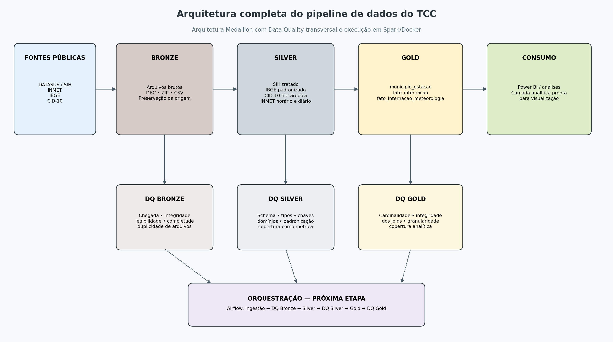

% Relatório de Arquitetura e Status do Pipeline de Dados — TCC
% Guilherme
% 26 de agosto de 2026

# Resumo executivo

O projeto implementa um pipeline de Engenharia de Dados para integrar internações hospitalares do SIH/DATASUS, dados meteorológicos do INMET, municípios do IBGE e a classificação CID-10. O recorte principal é o estado de São Paulo, com competências de 2023 a 2025.

A solução utiliza arquitetura Medallion, dividida em Bronze, Silver e Gold. Cada camada possui responsabilidades próprias e uma camada formal de Data Quality. Os processamentos são executados com Python e Apache Spark dentro de Docker. O pipeline de dados e os controles de qualidade estão implementados; a orquestração com Airflow e o consumo em Power BI são etapas posteriores.

# Arquitetura do projeto

{width=95%}

O fluxo lógico é:

1. As fontes públicas são ingeridas e preservadas na Bronze.
2. O Data Quality da Bronze confirma chegada, integridade e legibilidade.
3. A Silver transforma, padroniza e organiza os datasets.
4. O Data Quality da Silver valida schema, tipos, chaves, domínios e consistência.
5. A Gold integra as dimensões e fatos para uso analítico.
6. O Data Quality da Gold prova que os joins preservaram cardinalidade, granularidade e significado analítico.
7. Airflow deverá orquestrar essa sequência, impedindo o avanço quando uma regra crítica falhar.

# Tecnologias e ambiente

| Componente | Uso no projeto |
|---|---|
| Python | Ingestão, transformações e controles técnicos |
| Apache Spark 3.5 / PySpark | Processamento distribuído das camadas Silver e Gold |
| Docker Compose | Ambiente reproduzível de desenvolvimento |
| JupyterLab | Exploração e testes locais |
| Parquet | Persistência das tabelas Silver e Gold |
| PyArrow | Conversões e escrita intermediária do SIH |
| pyreaddbc / dbfread | Leitura e conversão dos arquivos DBC/DBF do SIH |
| pyshp | Processamento da malha municipal do IBGE |
| Airflow | Próxima etapa de orquestração |
| Power BI | Camada de consumo analítico planejada |

O serviço Docker atual chama-se `spark`, usa a imagem `jupyter/pyspark-notebook:spark-3.5.0`, monta `src`, `data` e `notebooks` em `/home/jovyan/work` e expõe o JupyterLab na porta 8888.

# Fontes de dados

| Fonte | Conteúdo | Formato Bronze | Recorte |
|---|---|---|---|
| DATASUS / SIH | Autorizações de internação hospitalar reduzidas | DBC mensal | São Paulo, competências 2023–2025 |
| INMET | Observações meteorológicas históricas | ZIP anual com CSVs | Estações de São Paulo, 2023–2025 |
| IBGE | Malha e atributos municipais | ZIP com Shapefile/DBF | 645 municípios de SP, base 2022 |
| CID-10 | Capítulos, grupos, categorias e subcategorias | ZIP e CSV | Classificação oficial disponível na fonte |

# Camada Bronze

A Bronze preserva os arquivos recebidos sem aplicar regras analíticas. Os scripts existentes são `sih.py`, `inmet.py`, `ibge.py` e `cid10.py`.

O Data Quality está centralizado em `src/quality/bronze`:

- `dq_sih.py`: presença mensal, arquivos vazios, coerência ano/mês, abertura real do DBC e duplicidade por hash.
- `dq_inmet.py`: presença anual, integridade dos ZIPs, CSVs internos, legibilidade e coerência do ano.
- `dq_ibge.py`: integridade do ZIP e conjunto mínimo de componentes do Shapefile.
- `dq_cid10.py`: integridade do ZIP, CSVs esperados, cabeçalhos e correspondência entre ZIP e arquivos extraídos.

Os dados atuais foram aprovados: 36 arquivos SIH, três ZIPs anuais INMET, a malha IBGE 2022 e os quatro CSVs da CID-10.

# Camada Silver

A Silver transforma os dados brutos em datasets tipados e padronizados:

| Dataset | Resultado atual |
|---|---:|
| SIH | 8.409.047 registros |
| IBGE | 645 municípios |
| CID-10 | 12.451 códigos |
| INMET horário | 1.052.160 registros e 40 estações |
| INMET diário | 43.840 registros e 40 estações |

O processamento do INMET diário agrega as observações horárias por estação e data, preservando indicadores de quantidade de observações válidas para precipitação, temperatura, umidade e vento.

O framework reutilizável em `src/common/validators.py` oferece validações de colunas, tipos, quantidades, chaves únicas, nulos, intervalos, períodos, valores aceitos, condições e cobertura. Os resultados são classificados em:

- `ERROR`: reprova o dataset e interrompe o pipeline.
- `WARNING`: registra desvio relevante sem bloquear automaticamente.
- `INFO`: registra métricas descritivas.

Todos os cinco DQs Silver foram aprovados. A cobertura diária observada foi:

| Variável | Cobertura |
|---|---:|
| Temperatura | 92,23% |
| Umidade | 90,42% |
| Precipitação | 83,41% |
| Vento | 82,50% |

Esses percentuais são métricas, pois os nulos meteorológicos refletem características da fonte e não falhas da agregação.

# Camada Gold

## Município–estação

A tabela `municipio_estacao` associa cada município paulista à estação INMET selecionada, usando distância geográfica.

- 645 municípios, com `CD_MUN` único.
- 40 estações utilizadas.
- Nenhum município sem estação.
- Distância média: 34,29 km.
- Distância máxima: 145,63 km.

## Fato de internação

A `fato_internacao` integra SIH, IBGE, município–estação e CID-10. O volume final é de 8.409.047 registros, igual ao SIH Silver, comprovando que os joins não multiplicaram nem eliminaram internações.

Ela contém 645 municípios, 40 estações e 9.573 diagnósticos distintos. As categorias complementares `U09` e `U10`, ausentes no arquivo CID legado, são aceitas explicitamente na configuração; qualquer outra categoria desconhecida permanece como erro.

## Fato de internação com meteorologia

A `fato_internacao_meteorologia` integra a fato base com o INMET diário por `codigo_estacao + data_internacao`.

- Registros antes do join: 8.409.047.
- Registros depois do join: 8.409.047.
- Internações com meteorologia: 8.236.990.
- Internações fora do período INMET: 172.057, registradas como informação.
- Internações sem match dentro de 2023–2025: zero.
- Matches com 24 observações de origem: regra aprovada.
- Flags `meteorologia_disponivel` e `motivo_sem_meteorologia`: coerentes.

Cobertura por internação com match:

| Variável | Cobertura | Referência atual |
|---|---:|---:|
| Temperatura | 95,04% | 90% |
| Umidade | 94,66% | 90% |
| Precipitação | 84,94% | 80% |
| Vento | 86,78% | 80% |

# Organização do código

```text
TCC/
├── data/
│   ├── bronze/
│   ├── silver/
│   └── gold/
├── docker/
│   └── Dockerfile
├── notebooks/
├── src/
│   ├── bronze/
│   ├── silver/
│   ├── gold/
│   ├── common/
│   │   └── validators.py
│   └── quality/
│       ├── bronze/
│       ├── silver/
│       └── gold/
├── docker-compose.yml
├── requirements.txt
└── README.md
```

# Execução dos controles de qualidade

Exemplos no PowerShell, a partir da raiz do projeto:

```powershell
docker compose up -d

# Bronze
docker compose exec -T spark /opt/conda/bin/python src/quality/bronze/dq_cid10.py
docker compose exec -T spark /opt/conda/bin/python src/quality/bronze/dq_ibge.py --ano 2022
docker compose exec -T spark /opt/conda/bin/python src/quality/bronze/dq_inmet.py --ano-inicio 2023 --ano-fim 2025
docker compose exec -T spark /opt/conda/bin/python src/quality/bronze/dq_sih.py --ano-inicio 2023 --mes-inicio 1 --ano-fim 2025 --mes-fim 12

# Silver
docker compose exec -T spark spark-submit src/quality/silver/dq_sih.py
docker compose exec -T spark spark-submit src/quality/silver/dq_ibge.py
docker compose exec -T spark spark-submit src/quality/silver/dq_cid10.py
docker compose exec -T spark spark-submit src/quality/silver/dq_inmet.py
docker compose exec -T spark spark-submit src/quality/silver/dq_inmet_diario.py

# Gold
docker compose exec -T spark spark-submit src/quality/gold/dq_municipio_estacao.py
docker compose exec -T spark spark-submit src/quality/gold/dq_fato_internacao.py
docker compose exec -T spark spark-submit src/quality/gold/dq_fato_internacao_meteorologia.py
```

# Preparação para o Airflow

Os módulos de DQ retornam relatórios estruturados e lançam `ValueError` em falhas críticas. Isso permite que futuras tasks do Airflow sejam marcadas como `FAILED` e bloqueiem as etapas seguintes. A sequência planejada é:

```text
bronze → dq_bronze → silver → dq_silver → gold → dq_gold → consumo
```

O Airflow ainda não está instalado no `docker-compose.yml` e não há DAGs implementadas. Recomenda-se, como próxima etapa, adicionar scheduler, webserver, banco de metadados e DAGs parametrizadas por período.

# Status consolidado

| Área | Status |
|---|---|
| Ingestão Bronze | Implementada |
| Transformações Silver | Implementadas |
| Modelagem Gold | Implementada |
| Data Quality Bronze | Implementado e aprovado |
| Data Quality Silver | Implementado e aprovado |
| Data Quality Gold | Implementado e aprovado |
| Ambiente Spark/Docker | Implementado |
| Airflow | Planejado, ainda não implementado |
| Power BI | Planejado, fora do repositório atual |

# Próximos passos recomendados

1. Implementar a orquestração Airflow e as dependências entre processamento e DQ.
2. Persistir os relatórios de qualidade em JSON ou tabela histórica para auditoria.
3. Parametrizar períodos e volumes esperados conforme a atualização das fontes.
4. Criar testes unitários para os validadores genéricos.
5. Construir o modelo e os painéis no Power BI.
6. Adicionar monitoramento de duração, volume, warnings e tendência de cobertura.

# Conclusão

O projeto possui atualmente uma arquitetura de dados completa até a camada Gold, com controles formais de qualidade adequados à responsabilidade de cada camada. A separação entre ingestão, transformação, integração e Data Quality reduz validações duplicadas, melhora a auditabilidade e deixa o pipeline preparado para orquestração com Airflow.
